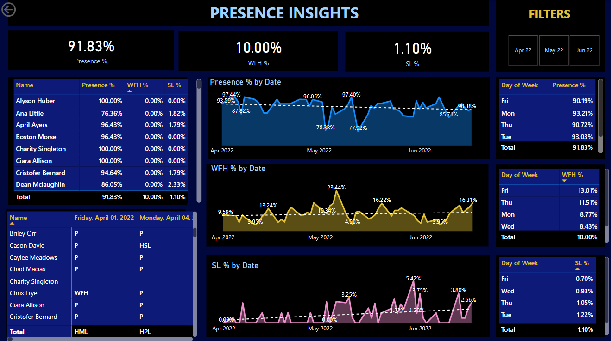

# 📊 Presence Insights – Power BI HR Dashboard

This Power BI project presents a comprehensive **employee attendance and presence analysis**, offering key insights into attendance patterns, work-from-home (WFH) trends, and sick leave (SL) metrics. The dashboard allows HR teams and managers to monitor workforce behavior, identify anomalies, and drive data-informed decisions around productivity and policy.

---

## 🧩 Problem Statement

The goal of this HR analytics project is to track and analyze employee attendance behavior across dates, individuals, and weekdays. It provides visual insights to answer key questions such as:

- What is the overall presence rate of employees?
- How frequently are employees working from home or taking sick leave?
- Which employees have lower presence or higher absence rates?
- How do attendance patterns vary across days and months?
- What trends emerge in presence, WFH, and SL over time?

---

## 📌 KPIs Tracked

- **Presence %** – Overall percentage of employees physically present.
- **WFH %** – Percentage of employees working from home.
- **SL %** – Percentage of employees on sick leave.
- **Employee-level Stats** – Presence, WFH, and SL by individual.
- **Date-wise Trends** – Presence, WFH, SL patterns over time.
- **Weekday Analysis** – Attendance breakdown by days of the week.

---

## 📊 Visualizations

| Visualization                     | Type          | Purpose                                                                 |
|----------------------------------|---------------|-------------------------------------------------------------------------|
| Presence % by Employee           | Table         | Displays presence, WFH, and SL per employee.                            |
| Presence % by Date               | Line/Area     | Tracks daily presence patterns over the quarter.                        |
| WFH % by Date                    | Line/Area     | Visualizes work-from-home frequency trends.                             |
| SL % by Date                     | Line/Area     | Shows sick leave behavior and spikes.                                   |
| Attendance Log Table             | Matrix Table  | Lists daily statuses (P, WFH, SL) for each employee.                    |
| Day of Week Analysis             | Bar Chart     | Identifies which weekdays have higher or lower attendance.              |

---

## 🔧 Features & Tools Used

- **Power BI Desktop**
- **Excel (.xlsx)** as the data source
- **Power Query Editor** for data transformation and cleaning
- **DAX Functions**:
  - `CALCULATE`, `DIVIDE`, `COUNTROWS`
  - `FILTER`, `ALL`, `DATESMTD`
- **Date Hierarchies**: Custom timeline navigation by month and day
- **Interactive Filters**: By date range, weekday, and status
- **Conditional Formatting**: Highlights low attendance or high SL%

---

## 📁 Files Included

- `HR_Dashboard.png` – Visual snapshot of the Presence Insights dashboard
- `Attendance Sheet 2022-2023_Masked.xlsx` – Masked Excel data source used in the project

---

## 💡 Insights & Observations

- The overall **Presence % is 91.83%**, indicating high attendance.
- **WFH usage peaked** at 23.44% in May 2022.
- **SL trends** show occasional spikes, suggesting possible seasonal effects.
- Some employees (e.g., **Alyson Huber**, **Charity Singleton**) have perfect attendance.
- Attendance is **lower on Fridays** and **highest on Mondays**.

---

## 🚀 Future Enhancements

- Integrate with Power Automate to send weekly presence alerts to HR.
- Add filters by department or team.
- Incorporate employee performance or productivity data for deeper HR insights.
- Use AI/ML models to predict absenteeism trends.

---

